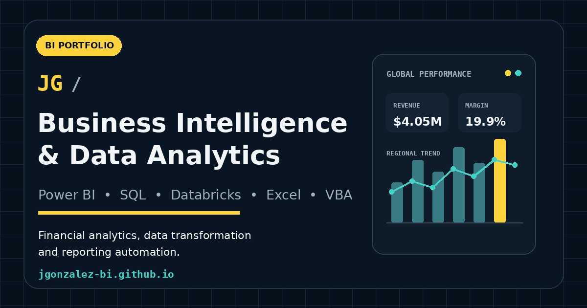

# Josué González — Business Intelligence & Data Analytics Portfolio



Professional bilingual portfolio focused on **Business Intelligence, financial analytics, data transformation, reporting automation, and operational solutions**.

**Live portfolio:** https://jgonzalez-bi.github.io/

## About This Portfolio

This website presents selected projects based on practical experience with:

- Power BI, DAX, and data modeling
- SQL, Databricks, and PySpark
- Power Query and advanced Excel
- VBA and reporting automation
- Financial and operational analytics
- Data quality validation and executive reporting

The portfolio was developed as a responsive static website using **HTML, CSS, and JavaScript**, without external frameworks.

## Featured Projects

### 1. Global Financial Performance Dashboard

Financial reporting case study focused on global FP&A dashboards, KPI validation, regional reconciliation, and reporting maintenance.

The public demonstration uses synthetic commercial data and includes report views for:

- Executive performance
- Product analysis
- Sales team performance
- Revenue, gross profit, and margin analysis

**Tools:** Power BI, DAX, SQL, Excel, Power Query, and data modeling.

### 2. Financial Spend Analytics Transformation

Migration of business rules, aggregations, and financial hierarchies from Power Query into Databricks to support a scalable reporting solution in Power BI.

The case study demonstrates:

- Layered transformations in Databricks
- SQL views and reusable aggregation tables
- Hierarchy transformation and ranking
- Window functions
- Integration with Power BI

Internal system names, catalogs, company names, and figures were generalized or anonymized.

### 3. Caregiver Operations Management System

Excel VBA solution created to centralize caregiver records, search candidates using multiple criteria, update information, and retrieve incident history through a single interface.

The case study includes:

- VBA UserForms
- Data validation
- Daily availability management
- Filters by language, location, and case preferences
- Related incident records
- Fully fictional demonstration data

## Repository Structure

```text
jgonzalez-bi.github.io/
├── index.html
├── README.md
├── robots.txt
├── sitemap.xml
├── site.webmanifest
│
├── executive-overview.png
├── product-analysis.png
├── sales-team-performance.png
│
├── assets/
│   ├── brand/
│   │   ├── apple-touch-icon.png
│   │   ├── favicon-32.png
│   │   ├── favicon.svg
│   │   ├── icon-192.png
│   │   ├── icon-512.png
│   │   └── social-preview.png
│   │
│   ├── css/
│   │   └── styles.css
│   │
│   ├── images/
│   │   ├── lhcsa-aide-manager.png
│   │   └── lhcsa-incidents.png
│   │
│   └── js/
│       ├── main.js
│       └── dashboard.js
│
├── case-studies/
│   ├── financial-dashboard.html
│   ├── databricks-migration.html
│   └── operations-automation.html
│
└── cv/
    ├── Josue_Gonzalez_CV_ES.pdf
    └── Josue_Gonzalez_CV_EN.pdf
```

## Website Features

- Responsive desktop and mobile design
- English and Spanish content
- Independent case-study pages
- Power BI report screenshot gallery
- Interactive financial dashboard recreation
- Downloadable CV in both languages
- Custom favicon and mobile icons
- Social sharing preview for LinkedIn and WhatsApp
- SEO descriptions, canonical URLs, sitemap, and robots file

## Technologies

```text
HTML5
CSS3
JavaScript
Power BI
DAX
SQL
Databricks
PySpark
Power Query
Excel
VBA
```

## Deployment

The website is published through GitHub Pages from the `main` branch.

```text
https://jgonzalez-bi.github.io/
```

## Data Privacy and Confidentiality

The projects reflect real analytical and technical experience, but:

- All displayed data is synthetic, fictional, or anonymized.
- Internal names and technical identifiers were generalized.
- No credentials, proprietary paths, or confidential company data are included.
- Public visualizations were recreated specifically for this portfolio.

## Contact

- **GitHub:** https://github.com/jgonzalez-bi
- **Portfolio:** https://jgonzalez-bi.github.io/

---

# Resumen en español

Portafolio profesional bilingüe enfocado en **Business Intelligence, análisis financiero, transformación de datos, calidad de datos y automatización de reportes**.

## Proyectos incluidos

- **Global Financial Performance Dashboard:** caso de reportería financiera global, validación de KPIs y análisis de desempeño mediante Power BI.
- **Financial Spend Analytics Transformation:** migración de transformaciones y jerarquías desde Power Query hacia Databricks para consumo en Power BI.
- **Caregiver Operations Management System:** solución en Excel VBA para centralizar registros, realizar búsquedas multicriterio y consultar incidentes.

El sitio fue desarrollado con HTML, CSS y JavaScript y está publicado mediante GitHub Pages. Todos los ejemplos públicos utilizan datos sintéticos, ficticios o anonimizados y no incluyen información confidencial.
